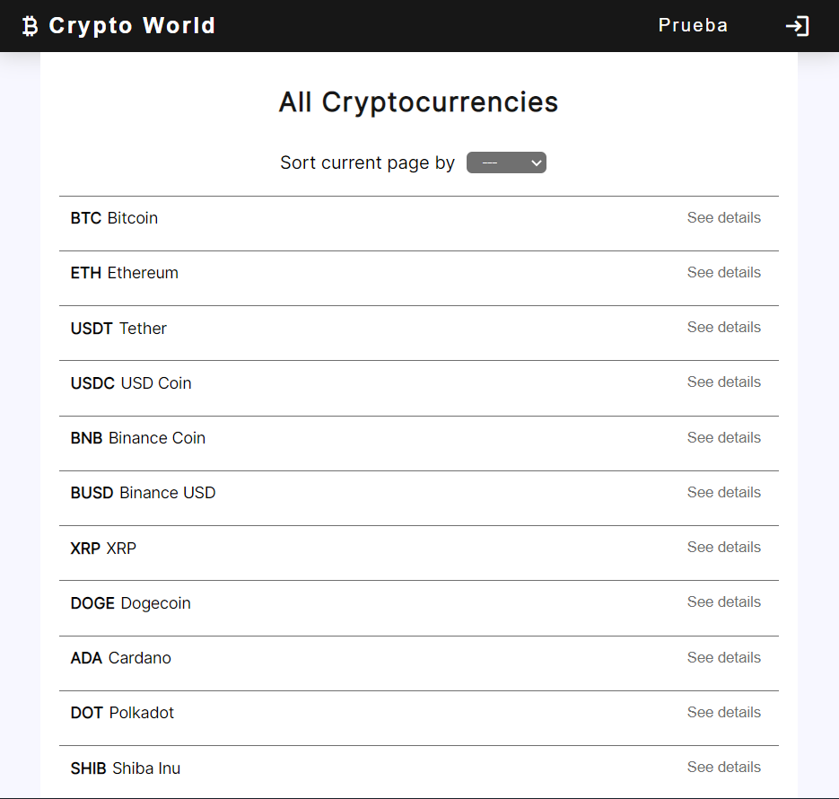
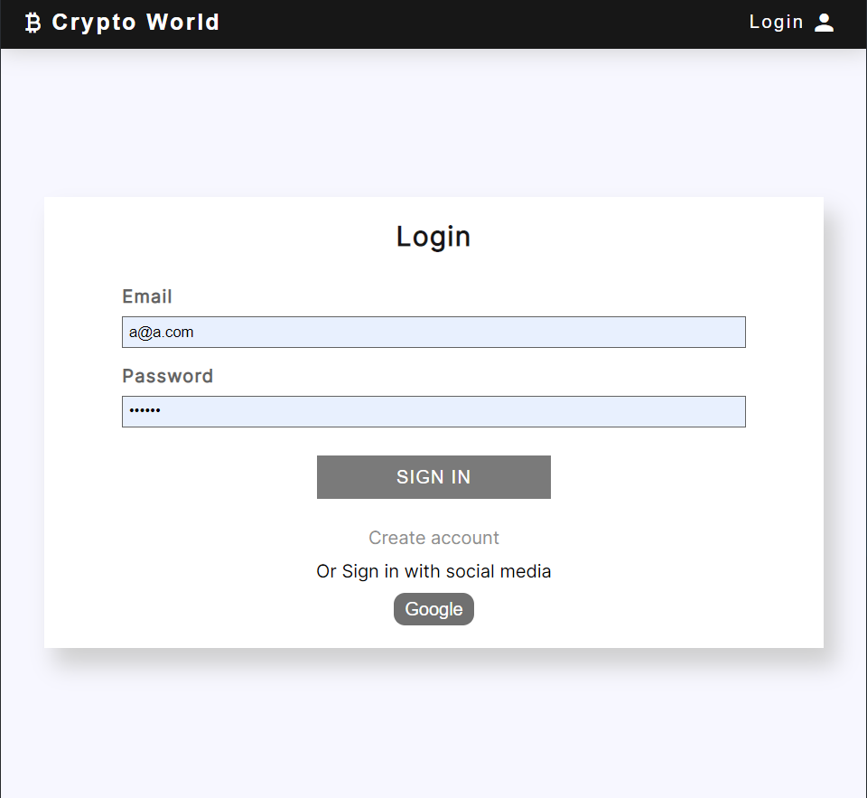
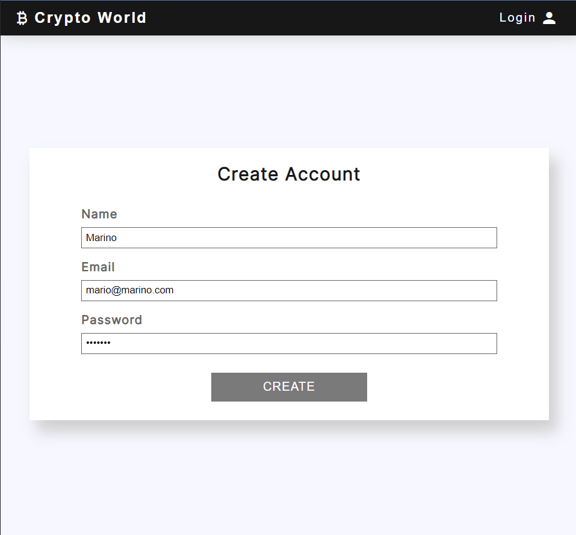

# Crypto World

Aplicación que permite ver a los usuarios las distintas criptomonedas actuales enlistadas, permite organizarlas de acuerdo a ciertos criteros y además permite ver a detalle cada una de estas.

El sitio fue desarrollado con ReactJS y sass, además hizo uso de los servicios de firebase para el manejo de sesiones dentro de la aplicación; con esto se logró la creación de cuentas y el inicio de sesión por medio de correo y por medio de google. Además, la sesión se almacena de forma global dentro de la aplicación por medio del context y el local storage.


## Instalación

Para instalar el proyecto, debes de seguir los siguientes comandos

```bash
  git clone
  npm install 
  npm run dev or 
  npm run build and npm run preview
```
    
## Screenshots
Lista de criptomonedas


Detalle


Login


Crear cuenta



## Producción

Además, te dejo el link de la aplicación corriendo en Producción.

https://crypto-world-orpin.vercel.app/